# Bypass Keenetic Web — Полное руководство для Obsidian

> **Версия документа:** 1.0
> **Дата:** 15.03.2026
> **Проект:** bypass_keenetic-web
> **Платформа:** Keenetic Router + Python Flask

---

## Содержание

1. [[#1-обзор-проекта|Обзор проекта]]
2. [[#2-установка|Установка]]
3. [[#3-миграция|Миграция]]
4. [[#4-обновление|Обновление]]
5. [[#5-команды-терминала-Команды терминала]]
6. [[#6-эксплуатация|Эксплуатация]]
7. [[#7-диагностика-и-устранение-неполадок|Диагностика и устранение неполадок]]
8. [[#8-диаграммы|Диаграммы]]

---

## 1. Обзор проекта

### 1.1 Что это такое

**Bypass Keenetic Web** — веб-интерфейс для управления системой обхода блокировок `bypass_keenetic` на роутерах Keenetic. Веб-интерфейс является альтернативой Telegram-боту и предоставляет тот же функционал через браузер.

```
┌─────────────────────────────────────────────────────────────────┐
│                        Пользователь                             │
│                    (Браузер на ПК/телефоне)                     │
└────────────────────────────┬────────────────────────────────────┘
                             │
                             │ HTTP :8080
                             ▼
┌─────────────────────────────────────────────────────────────────┐
│                    Bypass Keenetic Web                          │
│                    (Flask приложение)                           │
│  ┌──────────────┐  ┌──────────────┐  ┌──────────────┐         │
│  │   Routes     │  │   Services   │  │   Config     │         │
│  │  (Маршруты)  │  │  (Парсеры)   │  │  (Настройки) │         │
│  └──────────────┘  └──────────────┘  └──────────────┘         │
└────────────────────────────┬────────────────────────────────────┘
                             │
                             │ API Calls
                             ▼
┌─────────────────────────────────────────────────────────────────┐
│                    Keenetic Router                              │
│                    (192.168.1.1)                               │
│  ┌──────────────┐  ┌──────────────┐  ┌──────────────┐         │
│  │  Unblock    │  │   VPN Keys    │  │   System     │         │
│  │  (Списки)   │  │   (VLESS...)  │  │   (Config)   │         │
│  └──────────────┘  └──────────────┘  └──────────────┘         │
└─────────────────────────────────────────────────────────────────┘
```

### 1.2 Основные возможности

| Раздел | Описание |
|--------|----------|
| 🔑 **[[Ключи и мосты]]** | Управление VPN-ключами (Tor, VLESS, Trojan, Shadowsocks, VLESS+REALITY) |
| 📑 **[[Списки обхода]]** | Управление списками доменов для обхода блокировок |
| 📲 **[[Установка/удаление]]** | Установка и удаление компонентов системы |
| 📊 **[[Статистика]]** | Просмотр статистики трафика |
| ⚙️ **[[Сервис]]** | Перезапуск, бэкап, DNS override |

### 1.3 Требования

#### Аппаратные требования

| Параметр | Минимум | Рекомендуется |
|----------|---------|---------------|
| CPU | 500 MHz | 700 MHz+ |
| RAM | 128 MB | 256 MB+ |
| Flash | 16 MB | 32 MB+ |
| Свободное место | 20 MB | 50 MB+ |

#### Программные требования

| Компонент | Версия | Размер | Примечание |
|-----------|--------|--------|------------|
| [[Python]] | 3.8+ | ~10MB | Требуется интерпретатор |
| [[Flask]] | 3.0.0 | ~2.5MB | Веб-фреймворк |
| [[Jinja2]] | 3.1.2 | ~1MB | Шаблонизатор |
| [[Werkzeug]] | 3.0.0 | ~1MB | WSGI-утилиты |
| [[requests]] | >= 2.31.0 | ~500KB | HTTP-клиент |
| [[waitress]] | 2.1.2 | ~200KB | Production server (опционально) |

**Итого:** ~7MB (с waitress), ~5MB (без waitress)

> [!warning] Важно
> Перед установкой убедитесь, что на роутере установлен **Entware** и есть **20MB+** свободного места

### 1.5 Оптимизации для embedded-устройств

> [!success] Критические оптимизации (Фаза 1-2)
> Проект оптимизирован для работы на роутерах со 128MB RAM:
>
> **Память:**
> - Ротация логов: 100KB × 3 = 300KB макс. (was ∞)
> - LRU-кэш: 50 записей (was 100) → экономия ~15KB
> - MD5-хэш для VPN-ключей (was полные ключи) → экономия ~40KB
>
> **CPU:**
> - Кэширование статусов сервисов: 30с TTL → CPU ↓80%
> - ThreadPoolExecutor: 2 воркера max → нет блокировки интерфейса
>
> **Production:**
> - Waitress server: threads=2, connection_limit=10
> - Уменьшены таймауты requests: 30с → 15с

### 1.4 Сравнение с Telegram-ботом

> [!info] Отличия от Telegram
> Веб-интерфейс НЕ требует Telegram API и работает в локальной сети

```
┌────────────────────────────────────────────────────────────────────┐
│                    Сравнение интерфейсов                           │
├──────────────────────┬───────────────────┬───────────────────────┤
│      Параметр        │   Telegram Bot    │      Web Interface    │
├──────────────────────┼───────────────────┼───────────────────────┤
│ Потребление памяти   │      ~5 MB        │        ~15 MB          │
│ Зависимость          │  Telegram API     │        Нет             │
│ Интерфейс            │  Inline кнопки    │   Плитки (Cards)       │
│ Навигация            │ Callback queries  │  Полные перезагрузки   │
│ Доступность          │ Из anywhere       │  Только локальная сеть │
│ Мобильный интерфейс  │        ✓          │         ✓             │
└──────────────────────┴───────────────────┴───────────────────────┘
```

---

## 2. Установка

> [!info]-quick-start Быстрый старт
> 1. Включить Entware на роутере
> 2. Установить Python 3: `opkg install python3`
> 3. Скопировать файлы на роутер
> 4. Настроить .env
> 5. Запустить: `python3 app.py`

### 2.1 Варианты установки

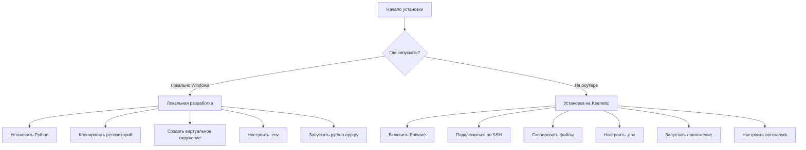

### 2.2 Установка на роутер (Keenetic)

#### Шаг 1: Подготовка роутера

```bash
# 1. Войдите на роутер по SSH
ssh root@192.168.1.1

# 2. Проверьте, что Entware установлен
opkg --version

# Если нет, установите Entware по инструкции производителя

# 3. Обновите список пакетов
opkg update
```

#### Шаг 2: Установка Python

```bash
# 1. Установите Python 3
opkg install python3

# 2. Проверьте версию
python3 --version

# 3. Установите pip (если не установлен)
opkg install python3-pip
```

#### Шаг 3: Создание директории

```bash
# 1. Создайте директорию для приложения
mkdir -p /opt/etc/bypass_keenetic_web

# 2. Перейдите в неё
cd /opt/etc/bypass_keenetic_web
```

#### Шаг 4: Копирование файлов

**Вариант А: С локального Windows-компьютера**

```powershell
# Из PowerShell или командной строки
# Путь к локальной папке проекта
$localPath = "H:\disk_e\dell\bypass_keenetic-web\src\web"

# Копирование на роутер
scp -r "$localPath\*" root@192.168.1.1:/opt/etc/bypass_keenetic_web/
```

**Вариант Б: С git-репозитория**

```bash
# На роутере
cd /opt/etc
git clone https://github.com/royfincher25-source/bypass_keenetic-web.git
cp -r bypass_keenetic-web/src/web_ui/* /opt/etc/bypass_keenetic_web/
```

#### Шаг 5: Настройка конфигурации

> [!tip] Конфигурация
> Подробнее о параметрах .env: [[#.env-конфигурация|Приложение Б]]

```bash
# 1. Перейдите в директорию приложения
cd /opt/etc/bypass_keenetic_web

# 2. Создайте .env из примера
cp .env.example .env

# 3. Отредактируйте конфигурацию
nano .env
```

**Минимальная конфигурация:**

```bash
# Конфигурация веб-интерфейса
WEB_HOST=0.0.0.0
WEB_PORT=8080
WEB_PASSWORD=your_secure_password

# Конфигурация роутера
ROUTER_IP=192.168.1.1
UNBLOCK_DIR=/opt/etc/unblock/
```

**Полный список параметров:**

| Параметр | Описание | По умолчанию |
|----------|----------|--------------|
| `WEB_HOST` | Адрес для прослушивания | `0.0.0.0` |
| `WEB_PORT` | Порт веб-интерфейса | `8080` |
| `WEB_PASSWORD` | Пароль для авторизации | `changeme` |
| `ROUTER_IP` | IP-адрес роутера | `192.168.1.1` |
| `UNBLOCK_DIR` | Директория unblock | `/opt/etc/unblock/` |
| `LOG_LEVEL` | Уровень логирования | `INFO` |
| `LOG_FILE` | Путь к лог-файлу | `/opt/var/log/web_ui.log` |

#### Шаг 6: Установка зависимостей

```bash
# 1. Установите зависимости Python
pip3 install -r requirements.txt

# 2. Или с использованием pip3 (альтернатива)
pip3 install Flask==3.0.0 Jinja2==3.1.2 Werkzeug==3.0.0 requests>=2.31.0 waitress==2.1.2

# 3. Проверка установки
pip3 list | grep -E "Flask|Jinja2|Werkzeug|requests|waitress"

# 4. Проверка импорта модулей
python3 -c "import flask, jinja2, werkzeug, requests; print('OK')"
```

> [!info] Зависимости
> | Пакет | Версия | Размер | Назначение |
> |-------|--------|--------|------------|
> | Flask | 3.0.0 | ~2.5MB | Веб-фреймворк |
> | Jinja2 | 3.1.2 | ~1MB | Шаблонизатор |
> | Werkzeug | 3.0.0 | ~1MB | WSGI-утилиты |
> | requests | >=2.31.0 | ~500KB | HTTP-клиент |
> | waitress | 2.1.2 | ~200KB | Production server |
>
> **Итого:** ~7MB (с waitress), ~5MB (без waitress)

#### Шаг 7: Первый запуск

```bash
# 1. Запуск вручную (для тестирования)
cd /opt/etc/bypass_keenetic_web
python3 app.py

# Приложение запустится на порту 8080
# Доступ: http://192.168.1.1:8080
```

**Запуск в фоновом режиме:**

```bash
# Запуск в фоне
nohup python3 app.py > /opt/var/log/web_ui.log 2>&1 &

# Или с использованием screen
screen -S bypass_web
python3 app.py
# Нажмите Ctrl+A, затем D для отключения
```

### 2.2.1 Рекомендации по установке

> [!checklist] Чек-лист перед установкой
>
> **1. Проверка ресурсов роутера:**
> ```bash
> # Проверить свободное место
> df -h /opt
> # Требуется: минимум 20MB, рекомендуется 50MB+
>
> # Проверить доступную память
> free -m
> # Требуется: минимум 64MB свободной
>
> # Проверить версию Python
> python3 --version
> # Требуется: Python 3.8+
> ```
>
> **2. Установка зависимостей:**
> ```bash
> # Вариант А: Из requirements.txt (рекомендуется)
> cd /opt/etc/bypass_keenetic_web
> pip3 install -r requirements.txt
>
> # Вариант Б: Прямая установка
> pip3 install Flask==3.0.0 Jinja2==3.1.2 Werkzeug==3.0.0 requests>=2.31.0 waitress==2.1.2
> ```
>
> **3. Проверка установки:**
> ```bash
> # Проверить установленные пакеты
> pip3 list | grep -E "Flask|Jinja2|Werkzeug|requests|waitress"
>
> # Проверить импорт модулей
> python3 -c "import flask, jinja2, werkzeug, requests; print('OK')"
> ```
>
> **4. Первый запуск:**
> ```bash
> # Запуск в фоновом режиме
> cd /opt/etc/bypass_keenetic_web
> nohup python3 app.py > /opt/var/log/web_ui.log 2>&1 &
>
> # Проверка процесса
> ps | grep python
>
> # Проверка порта
> netstat -tlnp | grep 8080
> ```

### 2.2.2 Чек-лист проверки после установки

> [!success] Проверка работоспособности
>
> **После установки:**
> ```bash
> # 1. Проверка процесса
> ps | grep python
> # Ожидается: python3 app.py запущен
>
> # 2. Проверка порта
> netstat -tlnp | grep 8080
> # Ожидается: порт 8080 открыт
>
> # 3. Проверка логов
> tail -f /opt/var/log/web_ui.log
> # Ожидается: нет ошибок ERROR/CRITICAL
>
> # 4. Проверка доступности
> curl -I http://localhost:8080
> # Ожидается: HTTP/1.0 302 Found (редирект на /login)
>
> # 5. Проверка размера логов
> ls -lh /opt/var/log/web_ui.log*
> # Ожидается: <300KB (3 файла по 100KB)
> ```
>
> **После оптимизаций:**
> ```bash
> # 1. Потребление памяти
> ps | grep python | awk '{print $2}'
> # Ожидается: ~10-15MB (was ~25MB)
>
> # 2. Проверка кэширования
> time curl http://localhost:8080/keys
> # 2-й запрос должен быть быстрее (кэш статусов 30с)
>
> # 3. Проверка ротации логов
> ls -lh /opt/var/log/web_ui.log*
> # Ожидается: 3 файла по ~100KB
>
> # 4. Проверка ThreadPoolExecutor
> curl http://localhost:8080/keys &
> curl http://localhost:8080/service &
> wait
> # Оба запроса выполнятся параллельно
> ```
>
> **Диагностика проблем:**
> ```bash
> # Если не запускается:
>
> # 1. Проверить логи
> tail -n 50 /opt/var/log/web_ui.log
>
> # 2. Проверить зависимости
> pip3 show flask
>
> # 3. Проверить .env
> cat /opt/etc/bypass_keenetic_web/.env
>
> # 4. Запустить в режиме отладки
> cd /opt/etc/bypass_keenetic_web
> python3 app.py
> # Смотреть вывод в консоль
> ```

### 2.3 Локальная разработка (Windows)

> [!info] Локальная разработка
> Для тестирования и разработки без роутера

#### Требования для Windows

| Компонент | Команда установки | Примечание |
|-----------|-------------------|------------|
| Python 3.8+ | [Скачать](https://www.python.org/downloads/) | Добавить в PATH |
| Git | [Скачать](https://git-scm.com/) | Опционально |

#### Установка

```powershell
# 1. Клонируйте репозиторий
git clone https://github.com/royfincher25-source/bypass_keenetic-web.git
cd bypass_keenetic-web

# 2. Перейдите в папку web
cd src\web

# 3. Создайте виртуальное окружение
python -m venv venv

# 4. Активируйте виртуальное окружение
# PowerShell:
.\venv\Scripts\Activate.ps1

# Командная строка:
venv\Scripts\activate.bat

# 5. Установите зависимости
pip install -r requirements.txt

# 6. Скопируйте .env.example в .env
copy .env.example .env

# 7. Отредактируйте .env
notepad .env

# 8. Запустите приложение
python app.py
```

#### Доступ

После запуска приложение будет доступно по адресу: **http://localhost:8080**

---

## 3. Миграция

> [!info]
> Подробная инструкция по миграции: [[MIGRATION_TEST_TO_WEB]]

### 3.1 Когда нужна миграция

Миграция необходима в следующих случаях:

1. **Переход с Telegram бота** — `bypass_keenetic` → `bypass_keenetic_web`
2. **Обновление структуры проекта** — изменение директорий или файлов
3. **Перенос на новый роутер** — с одного устройства на другое

### 3.2 Сценарий миграции: test → bypass_keenetic_web


#### Шаг 1: Резервное копирование

```bash
# На роутере: создайте резервную копию
# (выполните ДО удаления старой версии)

# 1. Создайте директорию для бэкапа
mkdir -p /opt/backup/bypass_keenetic_web

# 2. Скопируйте файлы
cp -r /opt/etc/bypass_keenetic_web/* /opt/backup/bypass_keenetic_web/

# 3. Сохраните конфигурацию
cp /opt/etc/bypass_keenetic_web/.env /opt/backup/bypass_keenetic_web/.env.backup
```

#### Шаг 2: Остановка старого приложения

```bash
# На роутере: остановите работающее приложение
pkill -f "python.*web"

# Проверьте, что процесс остановлен
ps | grep -E "python.*web"
```

#### Шаг 3: Удаление старой версии

```bash
# Удалите старую директорию бота
rm -rf /opt/etc/bypass_keenetic/

# Удалите стартовые скрипты (если были)
rm -f /opt/etc/init.d/S99bypass_test
```

#### Шаг 4: Установка новой версии

```bash
# На локальном компьютере: скопируйте новую версию
scp -r "H:\disk_e\dell\bypass_keenetic-web\src\web" root@192.168.1.1:/opt/etc/bypass_keenetic_web/
```

#### Шаг 5: Восстановление конфигурации

```bash
# На роутере: восстановите или создайте новую конфигурацию

# Вариант А: Использовать старую конфигурацию
cp /opt/backup/bypass_keenetic/.env.backup /opt/etc/bypass_keenetic_web/.env

# Вариант Б: Создать новую конфигурацию
cd /opt/etc/bypass_keenetic_web
cp .env.example .env
nano .env
```

#### Шаг 6: Запуск новой версии

```bash
# Запустите приложение
cd /opt/etc/bypass_keenetic_web
python3 app.py &

# Проверьте работу
curl http://localhost:8080
```

### 3.3 Структура директорий после миграции

> [!info] Структура файлов
> Полная структура проекта: [[#.8-2-Структура-проекта|Диаграмма структуры]]

```
/opt/etc/
├── bypass_keenetic_web/          # Новое приложение
│   ├── app.py                    # Flask приложение
│   ├── routes.py                 # Маршруты (Blueprint)
│   ├── env_parser.py             # Парсер .env
│   ├── core/
│   │   ├── __init__.py
│   │   ├── config.py             # WebConfig (Singleton)
│   │   ├── utils.py              # Утилиты, LRU-кэш
│   │   └── services.py           # Парсеры VPN-ключей
│   ├── templates/                # HTML шаблоны (Jinja2)
│   │   ├── base.html             # Базовый шаблон
│   │   ├── login.html            # Авторизация
│   │   ├── index.html            # Главное меню
│   │   ├── keys.html             # Ключи и мосты
│   │   ├── bypass.html           # Списки обхода
│   │   ├── install.html          # Установка/удаление
│   │   ├── stats.html            # Статистика
│   │   └── service.html         # Сервис
│   ├── static/
│   │   └── style.css             # Стили
│   ├── requirements.txt          # Зависимости
│   ├── .env                      # Конфигурация
│   └── .env.example              # Пример конфигурации
│
└── unblock/                      # Система обхода блокировок
    ├── 3proxy.cfg
    ├── server3.py
    └── ...
```

### 3.4 Миграция: перенос на новый роутер

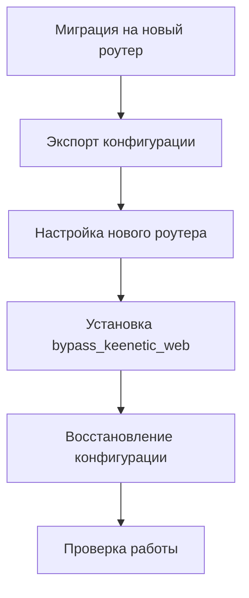

```bash
# На старом роутере: экспорт
ssh root@192.168.1.1 "tar -czf - -C /opt/etc bypass_keenetic_web" > backup.tar.gz

# На новом роутере: импорт
# 1. Установите Python и зависимости
opkg install python3 python3-pip

# 2. Создайте директорию
mkdir -p /opt/etc/bypass_keenetic_web

# 3. Распакуйте архив
tar -xzf backup.tar.gz -C /opt/etc/

# 4. Установите зависимости
cd /opt/etc/bypass_keenetic_web
pip3 install -r requirements.txt

# 5. Проверьте и обновите .env (особенно ROUTER_IP)
nano .env
```

---

## 4. Обновление

### 4.1 Виды обновлений

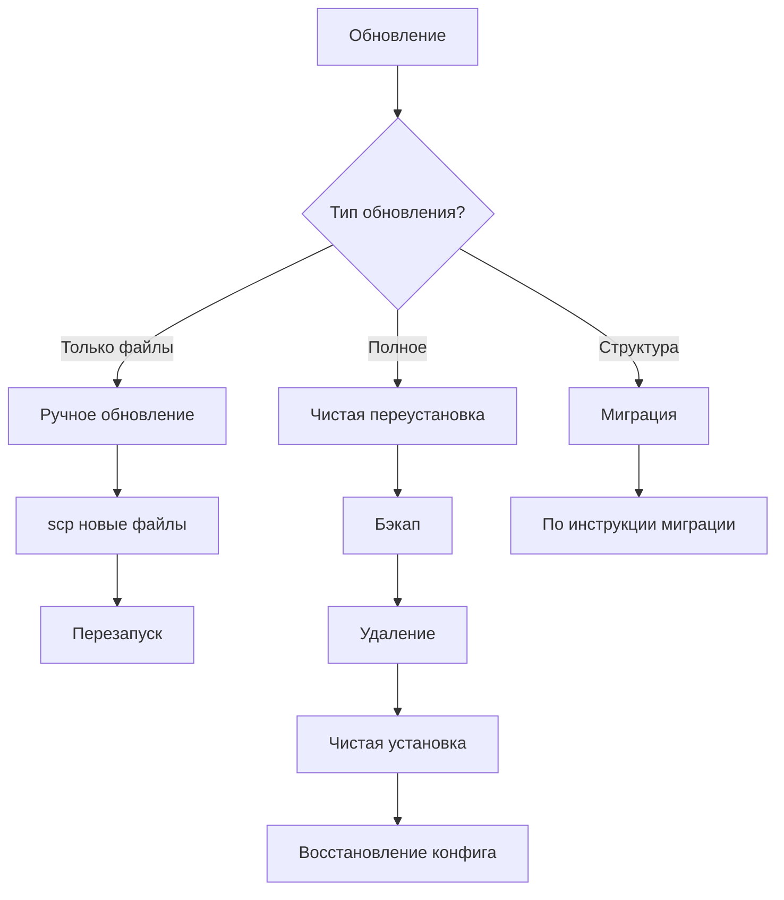

### 4.2 Ручное обновление (рекомендуется)

```bash
# На локальном компьютере: обновите файлы
# Вариант А: Копирование отдельных файлов

# Обновите только измененные файлы
scp src/web_ui/app.py root@192.168.1.1:/opt/etc/bypass_keenetic_web/
scp src/web_ui/routes.py root@192.168.1.1:/opt/etc/bypass_keenetic_web/
scp src/web_ui/core/*.py root@192.168.1.1:/opt/etc/bypass_keenetic_web/core/

# Обновите шаблоны
scp -r src/web_ui/templates/* root@192.168.1.1:/opt/etc/bypass_keenetic_web/templates/

# Обновите стили
scp src/web_ui/static/style.css root@192.168.1.1:/opt/etc/bypass_keenetic_web/static/
```

```bash
# Вариант Б: Синхронизация всей папки
rsync -avz --delete src/web_ui/ root@192.168.1.1:/opt/etc/bypass_keenetic_web/
```

### 4.3 Автоматическое обновление через скрипт

```bash
# Создайте скрипт обновления на роутере
cat > /opt/bin/update_bypass_web.sh << 'EOF'
#!/bin/sh

# Конфигурация
LOCAL_DIR="/opt/etc/bypass_keenetic_web"
REMOTE_USER="root"
REMOTE_HOST="192.168.1.1"
BACKUP_DIR="/opt/backup/bypass_web_$(date +%Y%m%d_%H%M%S)"

echo "=== Обновление bypass_keenetic_web ==="

# Создание бэкапа
echo "Создание бэкапа..."
mkdir -p "$BACKUP_DIR"
cp -r "$LOCAL_DIR"/* "$BACKUP_DIR/"

# Остановка приложения
echo "Остановка приложения..."
pkill -f "python.*app.py"

# Здесь должна быть команда загрузки новых файлов
# Например, через git или rsync
# git -C "$LOCAL_DIR" pull

# Перезапуск
echo "Перезапуск приложения..."
cd "$LOCAL_DIR"
nohup python3 app.py > /opt/var/log/web_ui.log 2>&1 &

echo "Обновление завершено!"
echo "Бэкап сохранён в: $BACKUP_DIR"
EOF

chmod +x /opt/bin/update_bypass_web.sh
```

### 4.4 Обновление через Git

```bash
# На роутере: если проект уже клонирован через git
cd /opt/etc/bypass_keenetic_web

# Посмотреть текущую ветку
git branch

# Обновить до последней версии
git pull origin main

# Перезапустить приложение
pkill -f "python.*app.py"
python3 app.py &
```

### 4.5 Откат изменений

```bash
# Если что-то пошло не так: откат к предыдущей версии

# Вариант А: Из бэкапа
rm -rf /opt/etc/bypass_keenetic_web
cp -r /opt/backup/bypass_web_YYYYMMDD_HHMMSS /opt/etc/bypass_keenetic_web

# Вариант Б: Через git
cd /opt/etc/bypass_keenetic_web
git log --oneline -10  # Посмотреть коммиты
git checkout <коммит>  # Откатиться к коммиту

# Вариант В: Из предыдущего состояния
cd /opt/etc/bypass_keenetic_web
git stash             # Сохранить текущие изменения
git checkout HEAD~1  # Перейти к предыдущему коммиту
```

---

## 5. Команды терминала

> [!tip] Быстрый справочник
> Основные команды: [[#.Приложение-А-Быстрые-команды|Приложение А]]

### 5.1 Подключение к роутеру

```bash
# SSH подключение
ssh root@192.168.1.1

# С указанием порта (если не стандартный 22)
ssh -p 22 root@192.168.1.1

# С использованием ключа
ssh -i ~/.ssh/id_rsa root@192.168.1.1
```

### 5.2 Управление файлами

```bash
# ===========================================
# КОПИРОВАНИЕ ФАЙЛОВ
# ===========================================

# Копирование с локального компьютера на роутер (из Windows PowerShell)
scp -r "H:\disk_e\dell\bypass_keenetic-web\src\web" root@192.168.1.1:/opt/etc/bypass_keenetic_web/

# Копирование с роутера на локальный компьютер
scp -r root@192.168.1.1:/opt/etc/bypass_keenetic_web "H:\disk_e\dell\bypass_keenetic-web\backup"

# Копирование файла
scp app.py root@192.168.1.1:/opt/etc/bypass_keenetic_web/

# ===========================================
# УДАЛЕНИЕ ФАЙЛОВ
# ===========================================

# Удаление директории
rm -rf /opt/etc/bypass_keenetic_web/

# Удаление файла
rm /opt/etc/bypass_keenetic_web/app.py

# Удаление с подтверждением
rm -i filename

# ===========================================
# СОЗДАНИЕ ДИРЕКТОРИЙ
# ===========================================

# Создание директории
mkdir -p /opt/etc/bypass_keenetic_web

# Создание вложенных директорий
mkdir -p /opt/etc/bypass_keenetic_web/core/templates

# ===========================================
# ПРОСМОТР ФАЙЛОВ
# ===========================================

# Просмотр содержимого директории
ls -la /opt/etc/bypass_keenetic_web/

# Рекурсивный просмотр
ls -R /opt/etc/bypass_keenetic_web/

# Просмотр файла
cat /opt/etc/bypass_keenetic_web/.env

# Просмотр с постраничным выводом
less /opt/etc/bypass_keenetic_web/app.py

# Просмотр первых строк
head -n 20 /opt/etc/bypass_keenetic_web/app.py

# Просмотр последних строк (для логов)
tail -f /opt/var/log/web_ui.log
```

### 5.3 Управление процессами

```bash
# ===========================================
# ЗАПУСК ПРИЛОЖЕНИЯ
# ===========================================

# Запуск вручную (в текущем терминале)
cd /opt/etc/bypass_keenetic_web
python3 app.py

# Запуск в фоновом режиме
cd /opt/etc/bypass_keenetic_web
nohup python3 app.py > /opt/var/log/web_ui.log 2>&1 &

# Запуск через screen
screen -S bypass_web
python3 app.py
# Ctrl+A, D - отключиться от screen
# screen -r bypass_web - вернуться

# Запуск через tmux
tmux new -s bypass_web
python3 app.py
# Ctrl+B, D - отключиться
# tmux attach -t bypass_web - вернуться

# ===========================================
# ОСТАНОВКА ПРИЛОЖЕНИЯ
# ===========================================

# Остановка по имени процесса
pkill -f "python.*app.py"

# Остановка по PID
kill <PID>

# Принудительная остановка
kill -9 <PID>

# Остановка всех процессов Python (осторожно!)
pkill -f python

# ===========================================
# ПРОВЕРКА СОСТОЯНИЯ
# ===========================================

# Просмотр запущенных процессов
ps aux | grep python

# Просмотр конкретного процесса
ps | grep app.py

# Просмотр процессов с фильтром
pgrep -f "python.*app.py"

# Подробная информация о процессе
ps -p <PID> -o pid,ppid,cmd,etime
```

### 5.4 Сетевые команды

```bash
# ===========================================
# ПРОВЕРКА ПОРТОВ
# ===========================================

# Просмотр открытых портов
netstat -tlnp

# Проверка конкретного порта
netstat -tlnp | grep 8080

# Проверка порта (альтернатива)
ss -tlnp | grep 8080

# Проверка доступности порта извне
nc -zv 192.168.1.1 8080

# ===========================================
# ТЕСТИРОВАНИЕ СОЕДИНЕНИЯ
# ===========================================

# Ping до роутера
ping 192.168.1.1

# Проверка доступности веб-интерфейса
curl -I http://192.168.1.1:8080

# Проверка с аутентификацией
curl -u admin:password http://192.168.1.1:8080

# ===========================================
# ПЕРЕНАПРАВЛЕНИЕ ПОРТОВ (PORT FORWARDING)
# ===========================================

# Проброс порта через SSH (локальный доступ)
ssh -L 8080:localhost:8080 root@192.168.1.1
# Теперь можно открыть http://localhost:8080
```

### 5.5 Работа с конфигурацией

```bash
# ===========================================
# РЕДАКТИРОВАНИЕ ФАЙЛОВ
# ===========================================

# Редактирование через nano
nano /opt/etc/bypass_keenetic_web/.env

# Сохранить: Ctrl+O, Enter
# Выйти: Ctrl+X

# Редактирование через vim
vim /opt/etc/bypass_keenetic_web/.env
# i - режим вставки
# Esc - выход из режима вставки
# :wq - сохранить и выйти

# ===========================================
# РАБОТА С .ENV
# ===========================================

# Просмотр текущих переменных
cat /opt/etc/bypass_keenetic_web/.env

# Добавление переменной
echo "NEW_VAR=value" >> /opt/etc/bypass_keenetic_web/.env

# Изменение значения
sed -i 's/OLD_VALUE/NEW_VALUE/g' /opt/etc/bypass_keenetic_web/.env

# ===========================================
# РЕЗЕРВНОЕ КОПИРОВАНИЕ
# ===========================================

# Простой бэкап
cp /opt/etc/bypass_keenetic_web/.env /opt/etc/bypass_keenetic_web/.env.backup

# Бэкап с датой
cp /opt/etc/bypass_keenetic_web/.env /opt/backup/.env.$(date +%Y%m%d)

# Автоматический бэкап при обновлении
cp -r /opt/etc/bypass_keenetic_web /opt/backup/bypass_web_$(date +%Y%m%d_%H%M%S)
```

### 5.6 Логирование и отладка

```bash
# ===========================================
# ПРОСМОТР ЛОГОВ
# ===========================================

# Просмотр лога приложения
cat /opt/var/log/web_ui.log

# Просмотр в реальном времени
tail -f /opt/var/log/web_ui.log

# Последние 50 строк
tail -n 50 /opt/var/log/web_ui.log

# Поиск ошибок в логах
grep -i error /opt/var/log/web_ui.log

# Просмотр системного лога
logread | grep bypass

# ===========================================
# ОТЛАДКА
# ===========================================

# Запуск с выводом отладочной информации
cd /opt/etc/bypass_keenetic_web
DEBUG=1 python3 app.py

# Запуск с подробным логированием
LOG_LEVEL=DEBUG python3 app.py
```

### 5.7 Работа с правами

```bash
# ===========================================
# ПРАВА ДОСТУПА
# ===========================================

# Изменение прав на файл
chmod +x /opt/bin/update_bypass_web.sh

# Изменение прав на директорию
chmod 755 /opt/etc/bypass_keenetic_web/

# Рекурсивное изменение
chmod -R 755 /opt/etc/bypass_keenetic_web/

# Изменение владельца
chown -R root:root /opt/etc/bypass_keenetic_web/
```

### 5.8 Управление автозапуском

```bash
# ===========================================
# INIT.D СКРИПТЫ
# ===========================================

# Создание скрипта автозапуска
cat > /opt/etc/init.d/S99bypass_web << 'EOF'
#!/bin/sh
case "$1" in
  start)
    cd /opt/etc/bypass_keenetic_web
    python3 app.py &
    ;;
  stop)
    pkill -f "python.*app.py"
    ;;
  restart)
    $0 stop
    sleep 2
    $0 start
    ;;
esac
EOF

# Сделать исполняемым
chmod +x /opt/etc/init.d/S99bypass_web

# Управление
/opt/etc/init.d/S99bypass_web start
/opt/etc/init.d/S99bypass_web stop
/opt/etc/init.d/S99bypass_web restart

# ===========================================
# SYSTEMD (для альтернативных прошивок)
# ===========================================

# Создание сервиса
cat > /etc/systemd/system/bypass-web.service << 'EOF'
[Unit]
Description=Bypass Keenetic Web Interface
After=network.target

[Service]
Type=simple
User=root
WorkingDirectory=/opt/etc/bypass_keenetic_web
ExecStart=/opt/bin/python3 /opt/etc/bypass_keenetic_web/app.py
Restart=always

[Install]
WantedBy=multi-user.target
EOF

# Управление
systemctl enable bypass-web
systemctl start bypass-web
systemctl stop bypass-web
systemctl restart bypass-web
systemctl status bypass-web
```

---

## 6. Эксплуатация

### 6.1 Автозапуск при загрузке

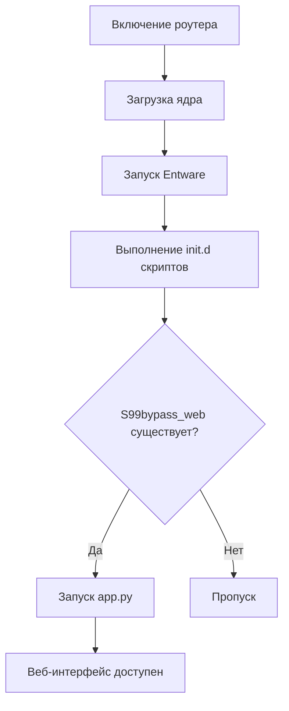

#### Способ 1: init.d скрипт (рекомендуется)

```bash
# Создайте скрипт автозапуска
cat > /opt/etc/init.d/S99bypass_web << 'EOF'
#!/bin/sh
# Bypass Keenetic Web AutoStart

case "$1" in
  start)
    echo "Starting Bypass Keenetic Web..."
    cd /opt/etc/bypass_keenetic_web
    python3 app.py > /dev/null 2>&1 &
    echo "Bypass Keenetic Web started"
    ;;
  stop)
    echo "Stopping Bypass Keenetic Web..."
    pkill -f "python.*app.py"
    echo "Bypass Keenetic Web stopped"
    ;;
  restart)
    $0 stop
    sleep 2
    $0 start
    ;;
  *)
    echo "Usage: $0 {start|stop|restart}"
    exit 1
    ;;
esac

exit 0
EOF

# Сделайте скрипт исполняемым
chmod +x /opt/etc/init.d/S99bypass_web

# Проверьте работу
/etc/init.d/S99bypass_web start
ps | grep app.py
```

#### Способ 2: rc.local

```bash
# Добавьте в /opt/etc/rc.local
nano /opt/etc/rc.local

# Добавьте строки перед exit 0:
# Запуск bypass_keenetic_web
if [ -x /opt/etc/bypass_keenetic_web/app.py ]; then
    cd /opt/etc/bypass_keenetic_web
    python3 app.py > /dev/null 2>&1 &
fi
```

### 6.2 Мониторинг

```bash
# ===========================================
# ПРОВЕРКА РАБОТЫ
# ===========================================

# Быстрая проверка (процесс запущен)
ps | grep -E "python.*app.py"

# Проверка порта
netstat -tlnp | grep 8080

# Проверка доступности
curl -s -o /dev/null -w "%{http_code}" http://192.168.1.1:8080

# Полная проверка всех сервисов
ps aux | grep -E "(python|3proxy|tor)" | grep -v grep

# ===========================================
# МОНИТОРИНГ РЕСУРСОВ
# ===========================================

# Использование памяти
ps -o pid,vsz,rss,pmem,comm -p $(pgrep -f "python.*app.py")

# Загрузка CPU
top -b -n 1 | grep python

# ===========================================
# АВТОМОНИТОРИНГ
# ===========================================

# Создайте скрипт мониторинга
cat > /opt/bin/check_bypass_web.sh << 'EOF'
#!/bin/sh
LOG_FILE="/opt/var/log/bypass_web_check.log"

if ! pgrep -f "python.*app.py" > /dev/null; then
    echo "$(date): Bypass Web not running, restarting..." >> $LOG_FILE
    cd /opt/etc/bypass_keenetic_web
    python3 app.py > /dev/null 2>&1 &
else
    echo "$(date): Bypass Web is running" >> $LOG_FILE
fi
EOF

# Добавьте в cron (каждые 5 минут)
# echo "*/5 * * * * /opt/bin/check_bypass_web.sh" >> /opt/etc/crontabs/root
```

### 6.3 Безопасность

> [!warning] Важно
> Соблюдайте рекомендации по безопасности для защиты вашего роутера

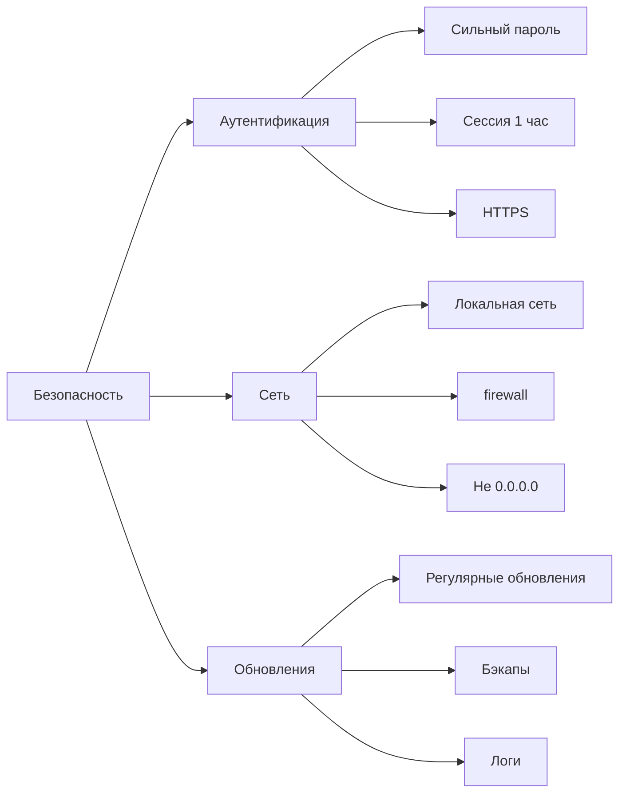

#### Рекомендации по безопасности

```bash
# 1. Используйте надежный пароль
# В файле .env:
WEB_PASSWORD=your_very_strong_password_here

# 2. Ограничьте доступ по IP (дополнительно)
# В app.py можно добавить проверку:
# from flask import request
# if request.remote_addr not in ['192.168.1.100', '192.168.1.101']:
#     abort(403)

# 3. Используйте HTTPS (требует настройки nginx или certbot)
# Это выходит за рамки данной инструкции

# 4. Регулярно обновляйте пароль
# Создайте новый .env и перезапустите приложение

# 5. Ограничьте доступ к SSH
# В настройках роутера: SSH только для локальной сети
```

### 6.4 Резервное копирование

```bash
# ===========================================
# РУЧНОЕ РЕЗЕРВНОЕ КОПИРОВАНИЕ
# ===========================================

# Создайте директорию для бэкапов
mkdir -p /opt/backup/bypass_web

# Создайте бэкап с датой
DATE=$(date +%Y%m%d_%H%M%S)
tar -czf /opt/backup/bypass_web/backup_$DATE.tar.gz \
    -C /opt/etc bypass_keenetic_web

# Скопируйте на локальный компьютер
scp root@192.168.1.1:/opt/backup/bypass_web/backup_$DATE.tar.gz \
    "H:\disk_e\dell\bypass_keenetic-web\backup\"

# ===========================================
# АВТОМАТИЧЕСКОЕ РЕЗЕРВНОЕ КОПИРОВАНИЕ
# ===========================================

# Создайте скрипт
cat > /opt/bin/backup_bypass_web.sh << 'EOF'
#!/bin/sh
BACKUP_DIR="/opt/backup/bypass_web"
DATE=$(date +%Y%m%d_%H%M%S)

mkdir -p $BACKUP_DIR

# Бэкап конфигурации
tar -czf $BACKUP_DIR/backup_$DATE.tar.gz \
    -C /opt/etc bypass_keenetic_web

# Удалить бэкапы старше 7 дней
find $BACKUP_DIR -name "backup_*.tar.gz" -mtime +7 -delete

echo "Backup created: backup_$DATE.tar.gz"
EOF

chmod +x /opt/bin/backup_bypass_web.sh

# Добавьте в cron (ежедневно в 3:00)
# echo "0 3 * * * /opt/bin/backup_bypass_web.sh" >> /opt/etc/crontabs/root
```

---

## 7. Диагностика и устранение неполадок

> [!example]- Поиск неисправностей
> Checklist для диагностики: [[#.Приложение-В-Troubleshooting-checklist|Приложение В]]

### 7.1 Типичные проблемы

| Проблема | Причина | Решение |
|----------|---------|---------|
| Не открывается страница | Приложение не запущено | Запустите `python3 app.py` |
| Ошибка 404 | Неправильный путь | Проверьте маршруты в routes.py |
| Ошибка 500 | Ошибка в коде | Проверьте логи |
| Неверный пароль | Неправильный .env | Проверьте WEB_PASSWORD |
| Нет доступа с других устройств | FIREWALL | Настройте firewall |
| Медленная работа | Мало ресурсов | Проверьте память, CPU |

> [!error] Ошибка "ModuleNotFoundError"
> Если возникает ошибка импорта, проверьте зависимости:
> ```bash
> pip3 install -r requirements.txt
> ```

> [!error] Ошибка "Address already in use"
> Порт 8080 уже занят другим процессом:
> ```bash
> netstat -tlnp | grep 8080
> pkill -f "python.*app.py"  # или kill <PID>
> ```

> [!error] Не работает автозапуск
> Проверьте права на скрипт:
> ```bash
> chmod +x /opt/etc/init.d/S99bypass_web
> ```

### 7.2 Диагностика

```bash
# ===========================================
# ШАГ 1: ПРОВЕРЬТЕ ПРОЦЕСС
# ===========================================
ps aux | grep python

# Должен быть процесс: python3 app.py

# ===========================================
# ШАГ 2: ПРОВЕРЬТЕ ПОРТ
# ===========================================
netstat -tlnp | grep 8080

# Должен быть список:
# tcp        0      0 0.0.0.0:8080            0.0.0.0:*               LISTEN      <PID>/python3

# ===========================================
# ШАГ 3: ПРОВЕРЬТЕ ЛОГИ
# ===========================================
tail -100 /opt/var/log/web_ui.log

# Ищите строки с ERROR, Exception, Traceback

# ===========================================
# ШАГ 4: ПРОВЕРЬТЕ ФАЙЛЫ
# ===========================================
ls -la /opt/etc/bypass_keenetic_web/

# Должны быть: app.py, routes.py, templates/, core/, .env

# ===========================================
# ШАГ 5: ПРОВЕРЬТЕ ЗАВИСИМОСТИ
# ===========================================
python3 -c "import flask; print(flask.__version__)"

# Должна вывести версию Flask

# ===========================================
# ШАГ 6: ТЕСТИРОВАНИЕ ВРУЧНУЮ
# ===========================================
cd /opt/etc/bypass_keenetic_web
python3 -c "from app import app; print('OK')"

# Должно вывести "OK" без ошибок
```

### 7.3 Отладка Flask-приложения

```bash
# Запуск в режиме отладки
cd /opt/etc/bypass_keenetic_web
FLASK_DEBUG=1 python3 app.py

# Запуск с интерактивной отладкой
cd /opt/etc/bypass_keenetic_web
python3 -i app.py

# Тестирование маршрутов
curl http://localhost:8080/
curl http://localhost:8080/keys
curl http://localhost:8080/bypass

# Тестирование с отладкой
curl -v http://localhost:8080/
```

### 7.4 Восстановление после сбоев

```bash
# Полное восстановление

# 1. Остановите всё
pkill -f python

# 2. Проверьте директорию
ls -la /opt/etc/bypass_keenetic_web/

# 3. Восстановите из бэкапа (если есть)
tar -xzf /opt/backup/bypass_web/backup_latest.tar.gz -C /opt/etc/

# 4. Переустановите зависимости
pip3 install --force-reinstall -r /opt/etc/bypass_keenetic_web/requirements.txt

# 5. Запустите
cd /opt/etc/bypass_keenetic_web
python3 app.py
```

---

## 8. Диаграммы

### 8.1 Архитектура системы

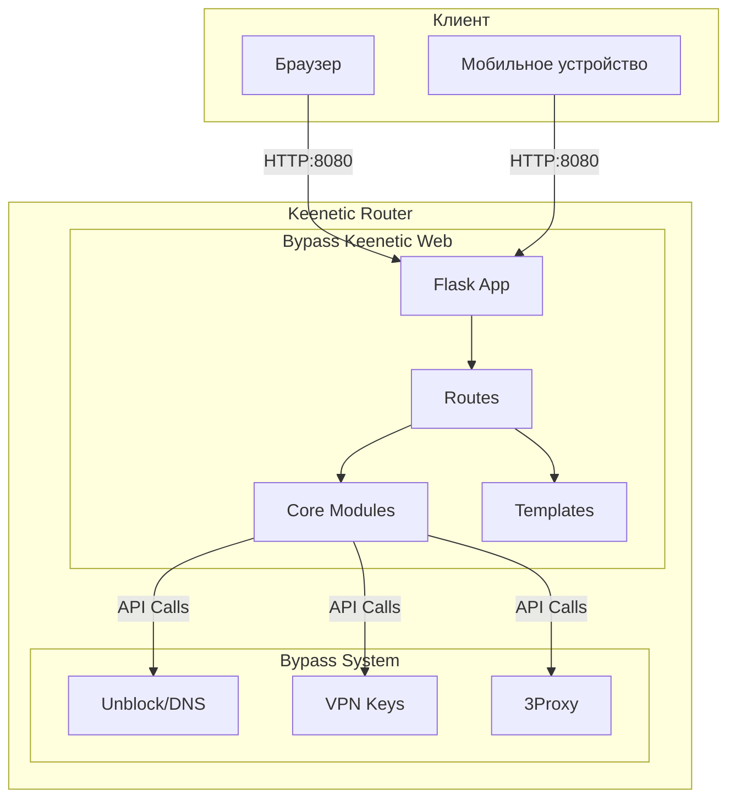

### 8.2 Структура проекта

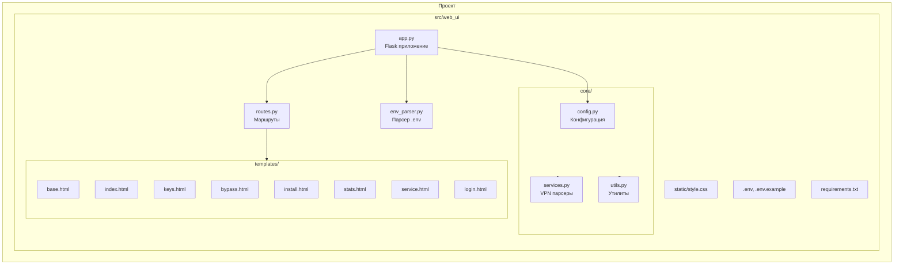

### 8.3 Процесс установки

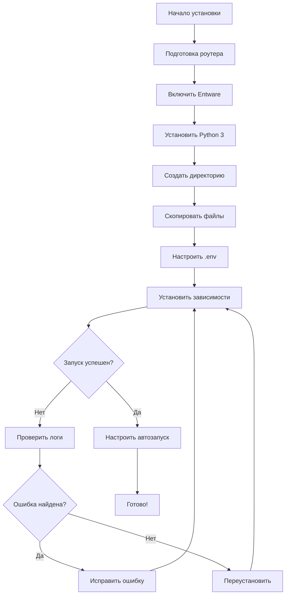

### 8.4 Процесс обновления

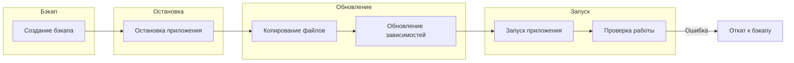

### 8.5 Жизненный цикл запроса

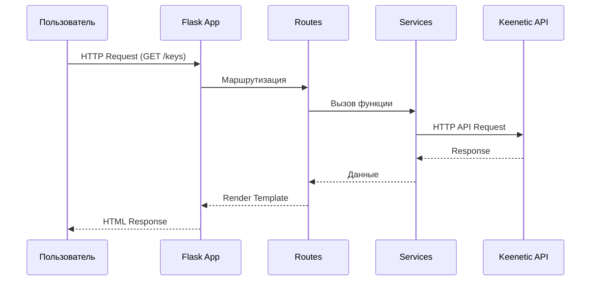

### 8.6 Модель безопасности

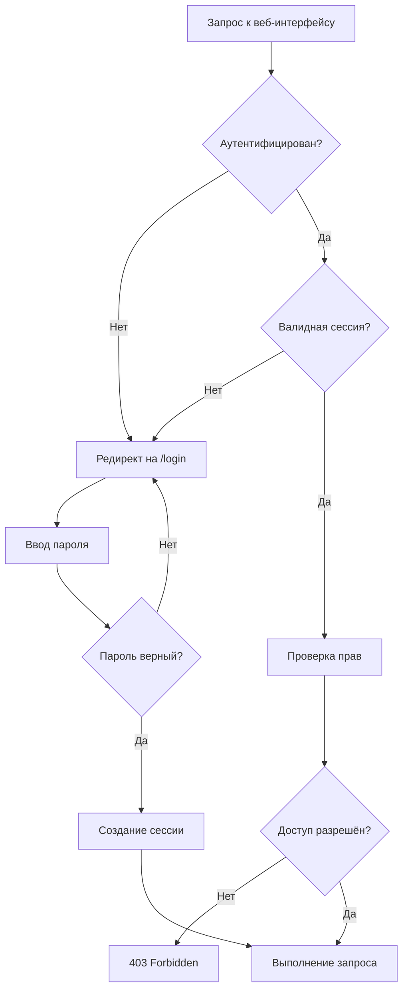

---

## Приложения

### Приложение А: Быстрые команды

> [!terminal] Терминал

```bash
# ╔══════════════════════════════════════════════════════════╗
# ║             БЫСТРЫЙ СПРАВОЧНИК КОМАНД                    ║
# ╚══════════════════════════════════════════════════════════╝

# ПОДКЛЮЧЕНИЕ
ssh root@192.168.1.1                    # SSH доступ

# ЗАПУСК
python3 app.py                          # Ручной запуск
nohup python3 app.py &                  # Фоновый запуск

# ОСТАНОВКА
pkill -f "python.*app.py"               # Остановка приложения

# ПРОВЕРКА
ps | grep app.py                        # Процесс запущен?
netstat -tlnp | grep 8080               # Порт занят?
curl http://192.168.1.1:8080            # Доступен?

# ЛОГИ
tail -f /opt/var/log/web_ui.log    # Просмотр логов

# ФАЙЛЫ
ls -la /opt/etc/bypass_keenetic_web/   # Содержимое директории
nano /opt/etc/bypass_keenetic_web/.env # Редактирование .env

# ОБНОВЛЕНИЕ
scp -r src/web_ui/* root@192.168.1.1:/opt/etc/bypass_keenetic_web/  # Копирование файлов

# АВТОЗАПУСК
/opt/etc/init.d/S99bypass_web start     # Запуск
/etc/init.d/S99bypass_web restart      # Перезапуск

# РЕЗЕРВНОЕ КОПИРОВАНИЕ
tar -czf backup.tar.gz -C /opt/etc bypass_keenetic_web  # Создание бэкапа
```

### Приложение Б: Структура .env

> [!config] Конфигурация
> Обязательно измените пароль по умолчанию!

```bash
# ╔══════════════════════════════════════════════════════════╗
# ║                   КОНФИГУРАЦИЯ .ENV                     ║
# ╚══════════════════════════════════════════════════════════╝

# ─────────────────────────────────────────────────────────
# ВЕБ-ИНТЕРФЕЙС
# ─────────────────────────────────────────────────────────
WEB_HOST=0.0.0.0          # Адрес прослушивания (0.0.0.0 = все)
WEB_PORT=8080             # Порт веб-интерфейса
WEB_PASSWORD=changeme     # Пароль (ИЗМЕНИТЕ!)

# ─────────────────────────────────────────────────────────
# РОУТЕР
# ─────────────────────────────────────────────────────────
ROUTER_IP=192.168.1.1     # IP-адрес роутера
UNBLOCK_DIR=/opt/etc/unblock/  # Директория unblock

# ─────────────────────────────────────────────────────────
# ЛОГИРОВАНИЕ
# ─────────────────────────────────────────────────────────
LOG_LEVEL=INFO             # Уровень: DEBUG, INFO, WARNING, ERROR
LOG_FILE=/opt/var/log/web_ui.log  # Путь к логу
```

| Параметр | Обязательно | По умолчанию | Описание |
|----------|-------------|--------------|----------|
| WEB_PASSWORD | ✅ Да | changeme | Пароль для входа |
| WEB_PORT | Нет | 8080 | Порт приложения |
| ROUTER_IP | Нет | 192.168.1.1 | IP роутера |

### Приложение В: Troubleshooting checklist

> [!checklist]

- [ ] 1. Роутер включен и доступен по IP
- [ ] 2. Python 3 установлен (`python3 --version`)
- [ ] 3. Зависимости установлены (`pip3 list | grep Flask`)
- [ ] 4. Файлы скопированы правильно
- [ ] 5. .env файл создан и заполнен
- [ ] 6. Процесс запущен (`ps aux | grep python`)
- [ ] 7. Порт прослушивается (`netstat -tlnp | grep 8080`)
- [ ] 8. Firewall не блокирует порт
- [ ] 9. Логи не содержат ошибок
- [ ] 10. Браузер не кэширует старую версию

---

## Ссылки

### Внутренние ссылки

- [[README]] — Основной README проекта
- [[MIGRATION_TEST_TO_WEB]] — Инструкция по миграции
- [[OBSIDIAN_INSTRUCTION]] — Этот документ

### Внешние ссылки

- **Репозиторий проекта:** https://github.com/royfincher25-source/bypass_keenetic
- **Entware для Keenetic:** https://help.keenetic.com/hc/ru/articles/360000409409
- **Flask Documentation:** https://flask.palletsprojects.com/
- **Python Documentation:** https://docs.python.org/3/

---

> **Автор документа:** AI Assistant  
> **Дата создания:** 15.03.2026  
> **Версия:** 1.0
